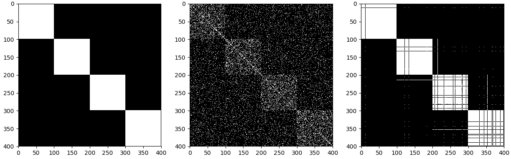

[](http://quantlet.de/index.php?p=info)

## [](http://quantlet.de/) **awcd** [](http://quantlet.de/d3/ia)

```yaml

Name of Quantlet: awcd

Published in: Phd Thesis

Description:  'Implementation of the Adaptive Weights Community Detection algorithm.'

Keywords: community-detection, kullback-leibler, nonparametric, adaptive-weights, gap-coefficient, graph-clustering, overlapping-communities

Author: Larisa Adamyan, Kirill Efimov, Vladimir Spokoiny

Submitted [python]: Tue, February 12 2019 by Larisa Adamyan

Output: 'plot of 3 windows: 1. the true weight matrix of a graph (white means 1, black is 0), 2. the adjacency matrix,  3. the final weight matrix detected by AWCD.'

```



Adaptive Weights Community Detection
-----------

AWCD is a novel non-parametric community detection technique based on adaptive weights. Weights are recovered using an iterative procedure based on statistical test of "no gap". The procedure is fully adaptive, allows overlapping communities, it is numerically feasible and applicable for large graphs, demonstrates very good performance on artifical and real world networks.

Setup
-----------

Build the latest development version from source:

    git clone https://github.com/QuantLet/awcd.git
    cd awcd
  Create, activate virtualenv and install the required packages.
  
    virtualenv -p python3 env && source env/bin/activate
    pip install -r awcd/requirements.txt
  
 Setup and build the C lib for sparce matrix multiplication.  
 
    cd awcd/src/cython_c_wrapper
    make
 
 Now all is set. Run the example file to see the AWCD result on a Stochastic Block Model.
 
    cd ../../
    python main.py

Requirements
-----
 python 3.6   
  gcc  

numpy  
matplotlib  
scipy  
sklearn  
scikit-learn==0.18.1  
cython  
numexpr  
networkx  
